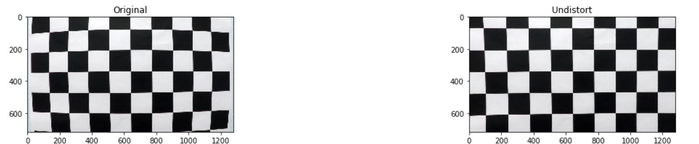

## Advanced Lane Finding

The Project
---
This is a advanced lane line finding project from Udacity. Please do note that I do not have access to the course. The approach taken to tackle the solution is fully based on google researching.

The goals / steps of this project are the following:

* Compute the camera calibration matrix and distortion coefficients given a set of chessboard images.
* Apply a distortion correction to raw images.
* Use color transforms, gradients, etc., to create a thresholded binary image.
* Apply a perspective transform to rectify binary image ("birds-eye view").
* Detect lane pixels and fit to find the lane boundary.
* Determine the curvature of the lane and vehicle position with respect to center.
* Warp the detected lane boundaries back onto the original image.
* Output visual display of the lane boundaries and numerical estimation of lane curvature and vehicle position.

The images for camera calibration are stored in the folder called `camera_cal`.  The images in `test_images` are for testing.

The Approach
---

## The camera calibration code

More info can be found in the [OpenCV Camera Calibration]. Camera calibration must be done because different camera have different degree of distortion in them. This is due to different lens make, focal points etc. Even the same camera from the same brand and make will slightly differ.

Camera calibration can also help in determining the relation between the image pixels and real world unit length.

[OpenCV Camera Calibration]:https://docs.opencv.org/2.4/doc/tutorials/calib3d/camera_calibration/camera_calibration.html
