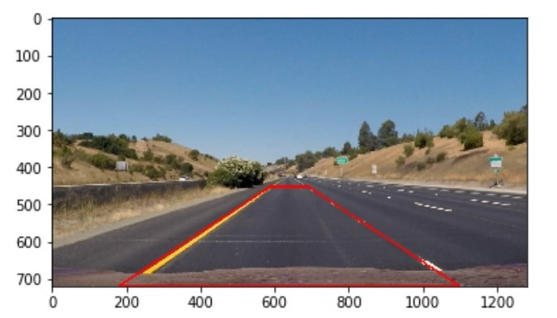
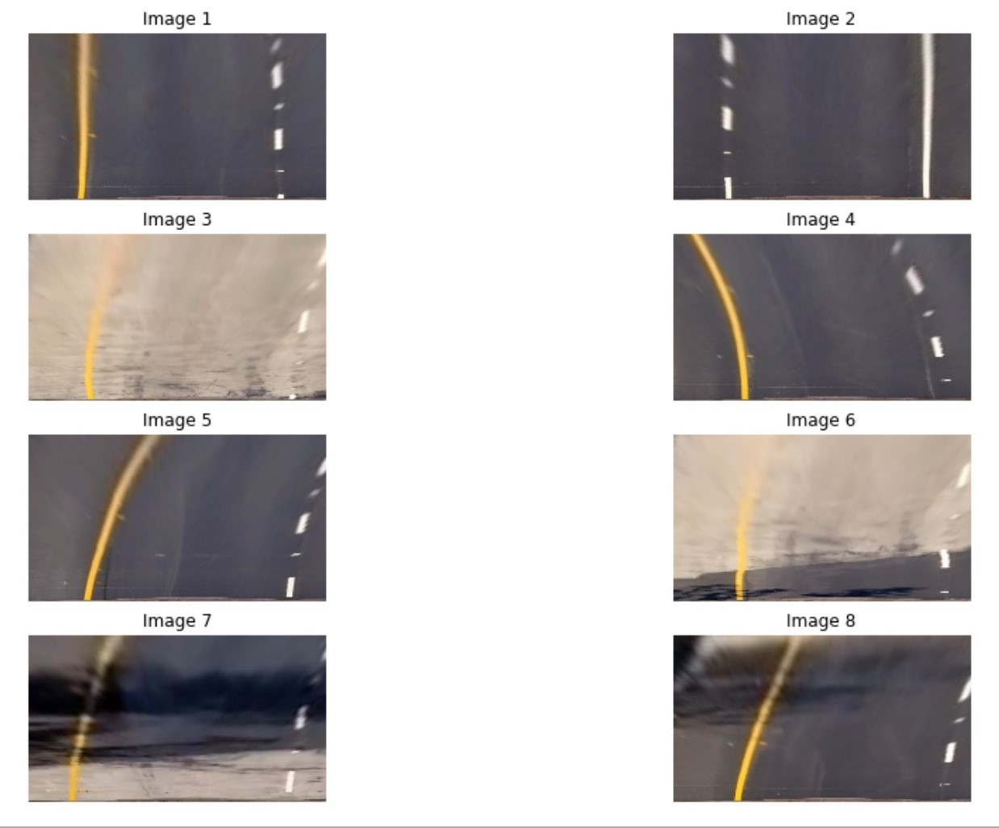

## Advanced Lane Finding

The Project
---
This is a advanced lane line finding project from Udacity. Please do note that I do not have access to the course. The approach taken to tackle the solution is fully based on google researching.

The goals / steps of this project are the following:

* Compute the camera calibration matrix and distortion coefficients given a set of chessboard images.
* Apply a distortion correction to raw images.
* Use color transforms, gradients, etc., to create a thresholded binary image.
* Apply a perspective transform to rectify binary image ("birds-eye view").
* Detect lane pixels and fit to find the lane boundary.
* Determine the curvature of the lane and vehicle position with respect to center.
* Warp the detected lane boundaries back onto the original image.
* Output visual display of the lane boundaries and numerical estimation of lane curvature and vehicle position.

The images for camera calibration are stored in the folder called `camera_cal`.  The images in `test_images` are for testing.

The Approach
---

### Camera Calibration

More info can be found in the [OpenCV Camera Calibration]. Camera calibration must be done because different camera have different degree of distortion in them. This is due to different lens make, focal points etc. Even the same camera from the same brand and make will slightly differ.

Camera calibration can also help in determining the relation between the image pixels and real world unit length. So ever single time the video frame has to go through undistortion before being processed.

### Changing Color Space
Image pixels are commonly known in the RGB Color Space. However, it is easier to perform color thresholding if the RGB is converted into the HSV color space. HSV gives the hue, saturation and value of the pixel of interest. To pick the threshold the yellow lane lines from the image from just the Hue value from the HSV Color Space is much easier then knowing how much red, green and blue there is to obtain a wide range of yellow.

### Edge Detection
Some of the solution available out there make use of the sobel edge detection algorithm.
One of the commonly used edge detection algorithm is called the Canny Edge detector. It is actually an optimised general purpose algorithm which uses the Sobel operator, however, we will like to optimised it for lane line detection. A very good explanation of the sobel edge detector can be found [here].

Also read the [OpenCV Sobel Documentation].
Due to saving the computational power, we can only convolute the Sobel kernel in the X direction.

Do note that the final pipeline does not include edge detection as color thresholding has been proven in the test videos that it has a higher accuracy in expense of computational speed.

### Perspective Transform
This is the process where we take a bounding area and then apply a transformation to the image to provide us a bird eye view. This process is particularly important as we can do lane detection easily. The image will be transformed back with the inverse transform matrix.

  

### Determine the curvature of the lane
The distance from center makes two assumptions:

1. The camera is located dead-center on the car
2. The lane width follows US regulation (3.7m)

Radius of curvature formula is given by:

$$R_{curve} = \frac{[1+(2Ay+B)^{2}]^{3/2}}{\left |2A\right |}$$

[here]:https://www.youtube.com/watch?v=uihBwtPIBxM
[OpenCV Sobel Documentation]:https://docs.opencv.org/2.4/doc/tutorials/imgproc/imgtrans/sobel_derivatives/sobel_derivatives.html
[OpenCV Camera Calibration]:https://docs.opencv.org/2.4/doc/tutorials/calib3d/camera_calibration/camera_calibration.html
